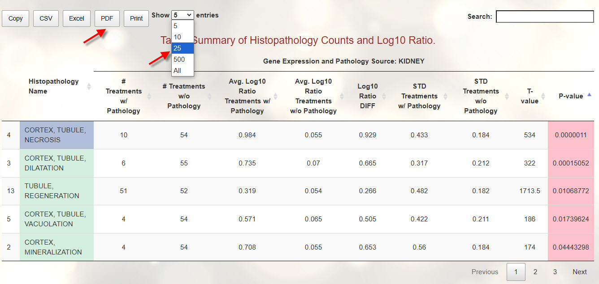
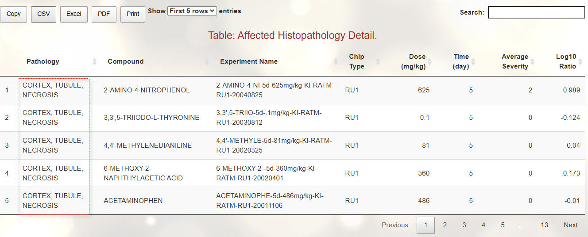

# DrugMatrix ApicalXOmics
DrugMatrix ApicalXOmics is an application for discovering genes associated with phenotypical changes (i.e., histopathologies, clinical pathologies, and organ weight changes) from DrugMatrix database. 

# Toxicogenomics and DrugMatrix Database
Toxicogenomics is the study of how genes and proteins respond to toxic substances, providing valuable insights into the molecular mechanisms behind adverse drug reactions and environmental toxicity. It explores how exposure to toxicants influences gene expression and the resulting biological effects (i.e., histopatholgy, clinical pathology, and organ weight change).

The DrugMatrix database is an integrated large-scale Rat toxicogenomic repository that contains the short-term rat toxicity study results from approximately 637 pharmaceuticals and environmental chemicals performed. The complete information about the database is available at CEBS site (https://cebs.niehs.nih.gov/cebs/paper/15670) at NIEHS.

The database has played a crucial role in toxicology research. It was initially developed to consolidate a wide range of toxicological and genomic data, enabling researchers to identify molecular signatures indicative of toxicity, diagnose pathological changes, and predict alterations in clinical pathology. The history and foundation of DrugMatrix have been well-documented, including in the book chapter provided as a reference.

> ## DrugMatrix Data Sets Include:
>
     - ~700 Short-term toxicity studies (0.25 to 5 days) in male SD rats
     - ~637 compounds studied at multiple doses, time points and tissues
     - ~4,000 dose-time-tissue combinations (biological triplicates)
     - ~13,000 CodeLink RU1 Microarrays
     - ~5,000 Affymetrix RG230-2 Arrays
     - ~8,000 BioSpyder S1500+/GENIE Temp-SEQ
     - ~127,000 histopathology measurements
     - ~100,000 hematology and chemistry measurements
     - ~130 different in vitro assays (not yet in the tool)
     - ~900 chemicals with detailed literature curation

> ## Gene Expression Platforms
> There are four gene expression platforms utilized in DrugMatrix: Codelink RU1, Affymetrix RG230-2, Sciome GENIE, and BioSpyder S1500+.
> ### CodeLink RU1
> First generation high-density microarray platform developed by GE Healthcare that measures approximately 10000 genes and transcripts. Details on the microarray expresion platform can be found here: https://www.ncbi.nlm.nih.gov/geo/query/acc.cgi?acc=GPL5424  https://www.ncbi.nlm.nih.gov/geo/query/acc.cgi?acc=GPL5425   https://www.ncbi.nlm.nih.gov/geo/query/acc.cgi?acc=GPL5426  
> ### Affymetrix RG230-2
> A part of the Affymetrix GeneChip family, designed specifically for rat model research. The Affymetrix Rat Genome 230 2.0 Array includes over 31,000 probe sets representing more than 30,000 genes and transcripts, offering comprehensive coverage of the rat genome. The RG230-2 array provides high specificity and sensitivity, making it a popular choice for detailed transcriptomic studies in rat models. Details on the microarray expresion platform can be found here: https://www.ncbi.nlm.nih.gov/geo/query/acc.cgi?acc=GPL1355
> ### BioSpyder S1500+
> A targeted, sequencing-based platform technology developed by BioSpyder that is based on the TempO-Seq technology. The rat S1500+ platform used to assess the DrugMatrix samples measures the expression of a specific set of 1,500 genes plus additional custom-selected genes for total of approximately 2700 rat genes. The gene selection process for the rat s1500+ platform  used a hybrid approach comprised of five sequential modules to identify the optimal set of genes that best represents biological diversity, addresses gene-gene co-expression relationships, and represents known pathways adequately. 
> ### Sciome GeniE
> Extrapolated data derived from a model (referred to as GeniE; https://www.sciome.com/genie/) developed by Sciome LLC, which levels covariance in gene expression to infer whole genome expression from the BioSpyder S1500+ which measured ~ 2700 genes.

# Search Strategy
Each toxicogenomic study in ApicalXOmics integrates multiple endpoints, including target organ histopathology, clinical pathology, and organ weight changes. This comprehensive design enables the identification of relationships between these endpoints, such as transcriptional biomarkers of pathology.

To facilitate this, we have developed a Shiny web application powered by the DrugMatrix database, allowing users to:
- **query a gene** to explore its relationship with all diagnosed pathologies, clinical pathologies, and experimental organ weight changes following chemical treatment.
- **query a specific pathology, clinical pathology, or organ weight change** to identify the most strongly associated genes.
- **identify chemical treatments** linked to apical endpoint findings, grouped by toxicological profiles.
- **discover potential pathway alterations** caused by specific treatments using the EnrichR analysis tool.

Users can refine their search by selecting criteria such as exposure duration, organ/tissue source of gene expression, gene probe, histopathology, and expression platform (CodeLink, Affymetrix, Genie, and BioSpyder). After defining the criteria, clicking the **SUBMIT** button generates results, which can be visualized graphically and downloaded in multiple formats.

# Quick Guide to Performing a Search
In addition to Project Description page, we have 9 other tabs:
- **Genes to Pathology**
  - *Question to address:* Which histopathologies are associated with changes of expressions in a gene (e.g., Havcr1)? If you are interested in knowing which histopathology is most significantly associated with a chosen gene in a specific tissue organ, you choose a tissue and an expression platform (e.g., CodeLink RU1) with an exposure time (e.g., 5 days).
  - Within about a minute, you will be able to see the data retrieved from the DrugMatrix database. The significance is measured by looking at the 3 columns in the Summary table displayed on the main panel - gene expression level average Log10 Ratio DIFF, T-value, and P-value (see explanation below).
  - Once you see the top row displayed in the Summary table, you may click on the pathology name, e.g. Cortext, tubule, necrosis. You will see all the experiments associated with the choice in detail shown in the table under the Summary table. In the meantime, a box plot with overlaying scatter plot shows at the bottom of the main panel.
  - To generate a report, you may choose PDF, csv, or Excel file format as shown in the upper corner of the table of your interest.

- **Pathology to Genes**
  - *Question to address:* Which genes show the most significant expression changes in association with a specific histopathology (e.g., Hepatocyte, Nonzonal, Lipid Accumulation, Macrovesicular)?
  - Similarly, significance is assessed using three columns in the Summary table on the main panel: Log10 Ratio DIFF, T-value, and P-value.
  - In the meantime, a list of associated pathological images, if there are any, with various severities (normal, minimal, mild, moderate, and marked) show on top of the main panel. A box plot with overlaying scatter plot shows on the bottom of the page. You may download the tabular data report the same way as described above.
    - Once the top row appears in the Summary table, you can click on a gene probe name (e.g., Havcr1) to view all associated experiments in detail in the table below.
    - If available, pathological images with varying severities (normal, minimal, mild, moderate, and marked) will appear at the top of the main panel.
    - A box plot with an overlaying scatter plot will be displayed at the bottom of the page.
    - You can download the tabular data report in the same way as described above.

- **Genes to Clinical Pathology**
  - *Question to address:* Which clinical pathologies are associated with changes of expressions in a gene (e.g., Abcc3)?
  - Select a gene of interest to identify the clinical assays that show strong expression in a chosen organ or tissue. Assay effects are determined by comparing the average assay value to the normal range. If the average value falls within this range, it is considered normal. Values above the upper bound indicate an increase, while those below the lower bound indicate a decrease.

- **Clinical Pathology to Genes**
  - *Question to address:* Which genes show the most significant expression changes in association with a specific decreased hematology (e.g., Hemoglobin)?
  - Select a clinical assay and an assay effect (increase or decrease) to identify the gene expressions most significantly associated with your selection.

- **Genes to Oragan Weight Change**
  - *Question to address:* Which gene shows the most significant expression change in association with an organ weight increase (e.g., Liver)?
  - Select a gene of interest and the direction of organ or tissue weight change to identify which expression source (e.g., LIVER) is most strongly associated with the change.
    
- **Organ Weight Change to Genes**
  - *Question to address:* Which genes show the most significant expression changes in association with a specific increased organ weight change (e.g., Liver) during a certain period of exposure (e.g., 5 days)?
  - Select the direction of organ or tissue weight change and the gene expression tissue source to identify which gene is most strongly associated with the weight change. Note that organ/tissue weight change is defined as a 10% increase or decrease relative to the mean whole-body weight.

- **Toxicologcal Profile**
  - *Question to address:* What outcomes are when you choose a treatment in a specific tissue (e.g., Liver)?
  -  Select an endpoint within the tool to retrieve a list of relevant treatments along with their corresponding exposure conditions.
  -  Identify chemical exposures linked to specific histopathological and clinical chemistry changes. The tool provides essential contextual details, including the chemical compound, dose, vehicle, and duration of exposure- in a qualittive manner.
    
- **Individual Chmical Expression and Enrichment**
  - *Question to address:* What pathways are altered by a specific treatment based on EnrichR analysis tool?
  - Analyze gene expression changes in a selected tissue or organ (e.g., liver) following short-term exposure to a chemical. The tool utilizes a public EnrichR database (e.g., KEGG_2021_Human) to predict pathway associations based on upregulated or downregulated genes identified from a microarray platform (e.g., Codelink RU1).
    
- **Scientific Citations**
  - Access a comprehensive list of scientific publications referenced in the development of this application. The citation page provides direct links to original research articles, reviews, and relevant studies.
  - Explore key studies that support the data sources, methodologies, and analytical approaches used in the application. This resource helps users understand the scientific foundation behind the tool’s design and implementation.
 
# Statistical Analysis
The impact of a pathology-associated genes is measured using three calculations.  Click a column header to sort the values.
- **DIFF**- The Log10 ratio difference between the severity score of the control group (treatment without pathology, severity = 0) and the treatment group with pathology (severity > 0). 
- **T-value**- Computed from paired Mann-Whitney observations comparing the average Log10 ratio between the treatment and non-treatment groups.
- **P-value**- Determined using the Mann-Whitney method to assess differences in severity scores (>0), normal range, and gene expression levels. Values ≥ 0.05 are highlighted in **pink**.

# Examplary Search Output

## Summary of Gene Expression and Toxicological Contexts
A key feature of ApicalXOmics, exemplified by the **Genes to Pathology** tool, is the ability to click on a pathology in the summary table to populate a detailed results table below. This provides users with comprehensive experimental details, including dose, duration, and gene expression values, enabling easier interpretation of findings.

You can download the tabular output in various formats, including PDF, CSV, and Excel.

## Detailed Report of Gene Expression and Exposure Conditions
After selecting a pathology of interest in the **Genes to Pathology** tool shown above, a detailed table appears below the summary, displaying comprehensive experimental data, including dose, duration, and gene expression values. The figure below presents the specific treatment data that supports the statistical summary.

## Boxplot Interpretation
A **dotted-box plot** is also generated when you select a gene of interest from the summary table. This visualization illustrates the relationship between severity scores and gene expression levels in a toxicology study using rat tissue samples (e.g., kidney).
- **X-axis**: Severity score for each chemical treatment. A score of 0 means no observed pathology, while values greater than 0 reflect increasing severity.
- **Y-axis**: Gene expression level, represented as a Log10 ratio.

Each dot represents a unique treatment group, defined by a specific combination of **chemical, dose, and duration**. In this example, the experiment was designed to induce a pathology called **Cortex, Tubule, Necrosis** and examine whether gene expression levels change in response.

From the plot, we can see that when there is **no pathology (severity = 0), gene expression levels remain low**. However, as severity increases, gene expression also increases, suggesting a potential link between the pathology and gene regulation.

This analysis helps us understand how gene expression responds to toxic effects, providing insights into potential **biomarkers for toxicity-related conditions (e.g. for kidney damage)**.

